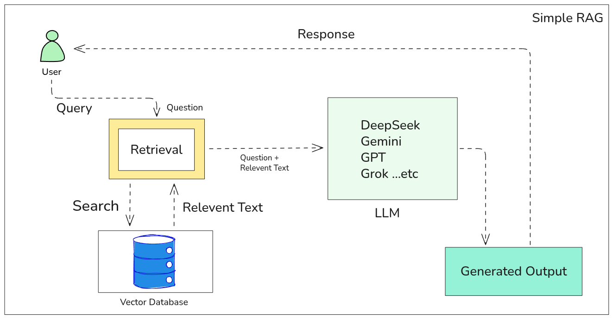
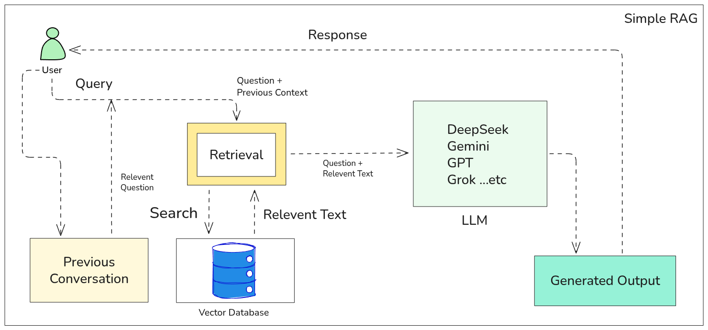
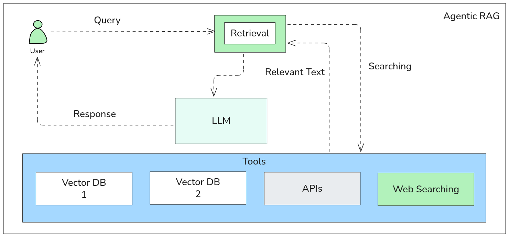
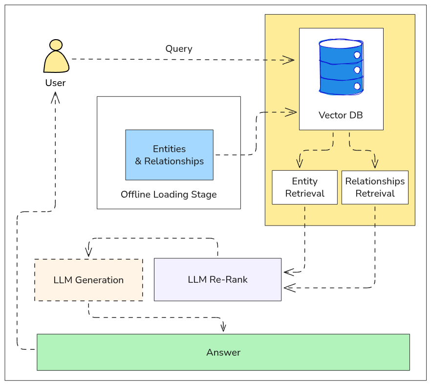
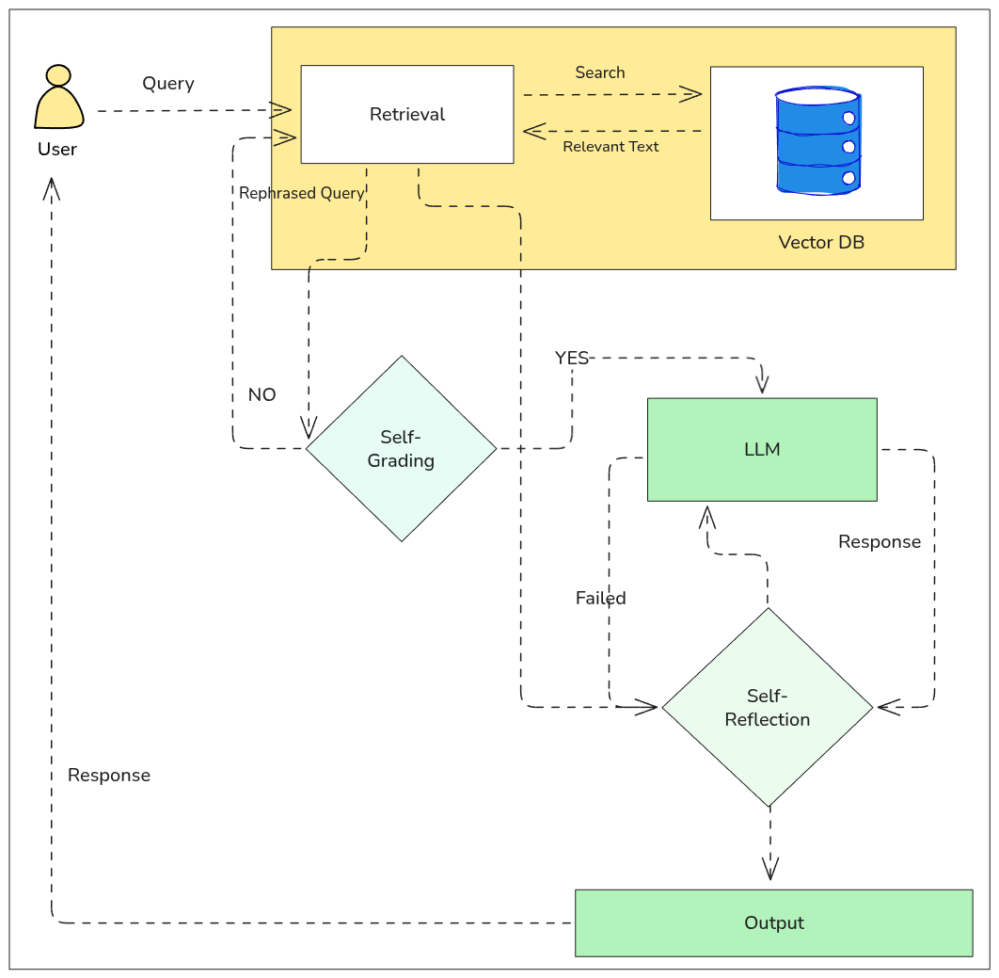
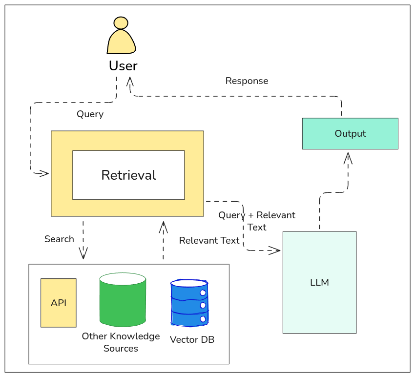

# RAG Types Overview

This is a simple guide to different types of RAG (Retrieval-Augmented Generation) techniques.  
It explains what each type does and when to use it, using easy words for learners.

## Table of RAG Types

<table>
  <thead>
    <tr>
      <th>RAG Type</th>
      <th>What It Does</th>
      <th>When to Use</th>
    </tr>
  </thead>
  <tbody>
    <tr>
      <td>Simple RAG (original)</td>
      <td>Looks at documents once and gives an answer.</td>
      <td>For easy questions and answers.</td>
    </tr>
    <tr>
      <td>Simple RAG with memory</td>
      <td>Remembers past chats to give better answers.</td>
      <td>For chatbots or helpers that need memory.</td>
    </tr>
    <tr>
      <td>Agentic RAG</td>
      <td>Thinks step by step and decides what to do next.</td>
      <td>For tasks that need planning.</td>
    </tr>
    <tr>
      <td>Graph RAG</td>
      <td>Finds answers using links in a knowledge map.</td>
      <td>When working with connected or organized data.</td>
    </tr>
    <tr>
      <td>Self-RAG</td>
      <td>Changes your question to get better search results.</td>
      <td>When the question is not clear.</td>
    </tr>
    <tr>
      <td>Branched RAG</td>
      <td>Looks at many answers and picks the best one.</td>
      <td>When a question has many possible answers.</td>
    </tr>
    <tr>
      <td>Multimodal RAG</td>
      <td>Works with text, images, audio, or video.</td>
      <td>For tasks not only with text, like visual Q&A.</td>
    </tr>
    <tr>
      <td>Adaptive RAG</td>
      <td>Changes how it works depending on the task.</td>
      <td>When questions are different types or levels.</td>
    </tr>
    <tr>
      <td>Speculative RAG</td>
      <td>Guesses useful searches before seeing full question.</td>
      <td>When you want faster answers.</td>
    </tr>
    <tr>
      <td>Corrective RAG</td>
      <td>Checks and fixes answers with better information.</td>
      <td>When correct answers are more important than speed.</td>
    </tr>
    <tr>
      <td>Modular RAG</td>
      <td>Lets you change or add tools for searching or answers.</td>
      <td>When testing or changing tools easily.</td>
    </tr>
    <tr>
      <td>Naive RAG</td>
      <td>Gives answers without checking or improving.</td>
      <td>For simple setup where quality is not important.</td>
    </tr>
    <tr>
      <td>Advanced RAG</td>
      <td>Uses many smart ways to give high-quality answers.</td>
      <td>For real systems that need very accurate answers.</td>
    </tr>
    <tr>
      <td>HyDE (Hypothetical doc)</td>
      <td>Imagines the document needed, then searches for it.</td>
      <td>When normal search does not work because the question is unclear.</td>
    </tr>
  </tbody>
</table>

## Simple RAG
Simple RAG is a way to make AI answers better by using extra documents or information.

## How it Works

1. **User Query** – The user asks a question.  
2. **Retrieve Relevant Text** – The system searches a **Vector Database** or other document stores to find relevant information.  
3. **Combine with LLM** – The retrieved text is combined with the user’s question and sent to a **Large Language Model (LLM)**.  
4. **Generate Response** – The LLM generates an answer using both the question and the retrieved information.  
5. **Return to User** – The generated response is sent back to the user.

Simple one-step retrieval + generation workflow.

**Use Case**: Questions and Answering Systems, Chatbot.

**Pros**:

1. Fast response times
2. Easy to set up and implement
3. Low computational cost

**Cons**:

1. No feedback after generating a response
2. Does not improve if the data retrieval is poor

## Simple RAG with Memory

Simple RAG with Memory is an enhanced version of Simple RAG that can remember past conversations or user interactions to give better, context-aware answers.

## How it Works

1. **User Query** : The user asks a question.  
2. **Retrieve Relevant Text** : The system searches a **Vector Database** or other document stores to find relevant information.  
3. **Add Memory Context** : Past interactions or conversation history are included along with the retrieved text.  
4. **Combine with LLM** : The retrieved text, memory context, and user question are sent to a **Large Language Model (LLM)**.  
5. **Generate Response** : The LLM generates a context-aware answer.  
6. **Return to User** : The response is sent back to the user.  
7. **Update Memory** : The system updates memory with the new conversation for future use.

RAG with memory is used in personal AI agents, conversational chatbots, customer support systems, educational tutoring platforms.

## Agentic RAG
Agentic RAG is an advanced Retrieval-Augmented Generation approach that plans, reasons, and iteratively retrieves information like an experienced researcher until it finds a complete and accurate answer.

## How It Works:
Traditional RAG is linear, but Agentic RAG is dynamic. It doesn't just search. It decides where to search, evaluates the results, and iterates until it finds the best answer.
1. **User Query**:
The process begins when a User submits a query. Instead of the LLM answering immediately from its own memory, it passes the request to a specialized Retrieval Layer.

2. **Retrieval**:
The Retrieval component acts as the brain. Based on the user's intent, it determines which Tools are necessary to fulfill the request. It doesn't just look at one database. It orchestrates a `Searching` phase across multiple environments.

3. **Tools**:
`Vector DB`: Searches through internal, private, or proprietary documentation. `APIs`: Pulls real-time data from external services (e.g., weather, stock prices, or CRM data). `Web Searching`: If the information isn't in internal databases, the agent can browse the live internet for the latest news or public facts.

4. **Relevant Text Extraction**
Once the tools return data, the system filters for Relevant Text. This ensures the LLM isn't overwhelmed with noise and only receives high-quality, factual context.

5. **LLM Synthesis & Response**
The LLM receives the original query plus the specifically retrieved Relevant Text. It then: Analyzes the provided context. Synthesizes an accurate, grounded answer. Sends the final Response back to the user.

Pros:

1. It plans and thinks step-by-step. so answers are usually more accurate and complete.
2. It does not stop at the first result. It keeps searching until the question is properly answered.
3. Can use multiple tools (search, databases, APIs) to gather better information.
4. Very effective for multi-step. research style, or open ended questions.

Cons:

1. Multiple planning and retrieval steps increase response time.
2. More computation and tool calls increase operational cost.
3. Harder to design, implement, and debug compared to simple RAG.
4. May perform unnecessary retrieval steps if not well controlled.

## Graph RAG
Graph RAG is an advanced form of RAG where knowledge is stored and retrieved as a graph instead of flat documents or chunks.

In Graph RAG information is represented as nodes (entities like people, services, APIs, models) and edges (relationships between them), and retrieval happens by traversing relationships, not just similarity search.

## How It Works

1. **The Offline Loading Stage (Preparation)**:
Before ask a question, the system prepares the data. It finds Entities and the Relationships between them (how they connect). This information is saved into a Vector DB.
2. **The User Query**:
When User ask a question, the system doesn't just look for keywords. It sends user query to the Vector DB to find the most relevant `map` of information.

3. **Retrieval**:
The system pulls out two things:
    1. Entity Retrieval: Key facts about the topics user mentioned.
    2. Relationships Retrieval: How those facts are linked together.

4. **LLM Re-Rank & Generation**
    1. LLM Re-Rank: Looks at all the retrieved facts and decides which ones are actually the most important for user specific question.

5. **LLM Generation**: The LLM takes the best facts and writes a natural, easy-to-read response.

Pros:
1. Great for complex questions requiring connecting multiple concepts
2. Helps prevent scattered answers
3. Can provide unexpected but relevant responses

Cons:
1. Requires significant work to build the knowledge graph
2. Slower than basic RAG systems

## Self-RAG
Self-RAG is an advanced RAG approach where the LLM evaluates and controls its own retrieval and generation process.

## How It Work
1. **Initial Query**:User asks a question.

2. **Retrieval**: Relevant documents are retrieved from a vector database.

3. **Draft Answer Generation**: LLM generates an initial answer using the retrieved context.

4. **Self-Evaluation (Reflection)**: LLM checks: Is the answer grounded in retrieved evidence? Are there missing facts? Is there any hallucination?
If confidence is low: Trigger additional retrieval. Refine the query.
If confidence is high: Finalize the answer

5. **Final Answer Generation**:
LLM produces a more accurate and reliable response.

Pros:

1. Helps get better results from vague questions
2. More reliable in scenarios where accuracy matters

Cons:

1. Higher costs to run all those extra checks
2. lower since it is doing the work twice
3. Can be too cautious and refuse to answer when uncertain

## Branched RAG
Branched RAG is a type of RAG that explores multiple lines of thought simultaneously before deciding on the best answer.

1. **User Query**:
- The user asks **one question**
- Example:  
  > “Is this ML model production ready?”

2. **Query Branching**:
- The original query is **split into multiple sub-queries**
- Each branch focuses on a **specific aspect** of the question

3. Parallel RetrievalEach branch retrieves data independently and in parallel

Example branches:
- Branch A → Vector DB (semantic documents)
- Branch B → Graph DB (entity relationships)
- Branch C→ SQL / Logs / APIs (structured or operational data)

4. **Merge Context**: 
- Results from all branches are combined into a single context
- Redundant or irrelevant information can be filtered
5. **LLM Generation**:
- The LLM uses the merged context
- Generates a complete, well-informed final answer

Pros:
1. Handles open-ended questions well
2. Less likely to miss important aspects of complex questions
3. Can provide more thoughtful final response

Cons:

1. Complex to coordinate findings from different sources
2. Can overwhelm users with information if not properly filtered